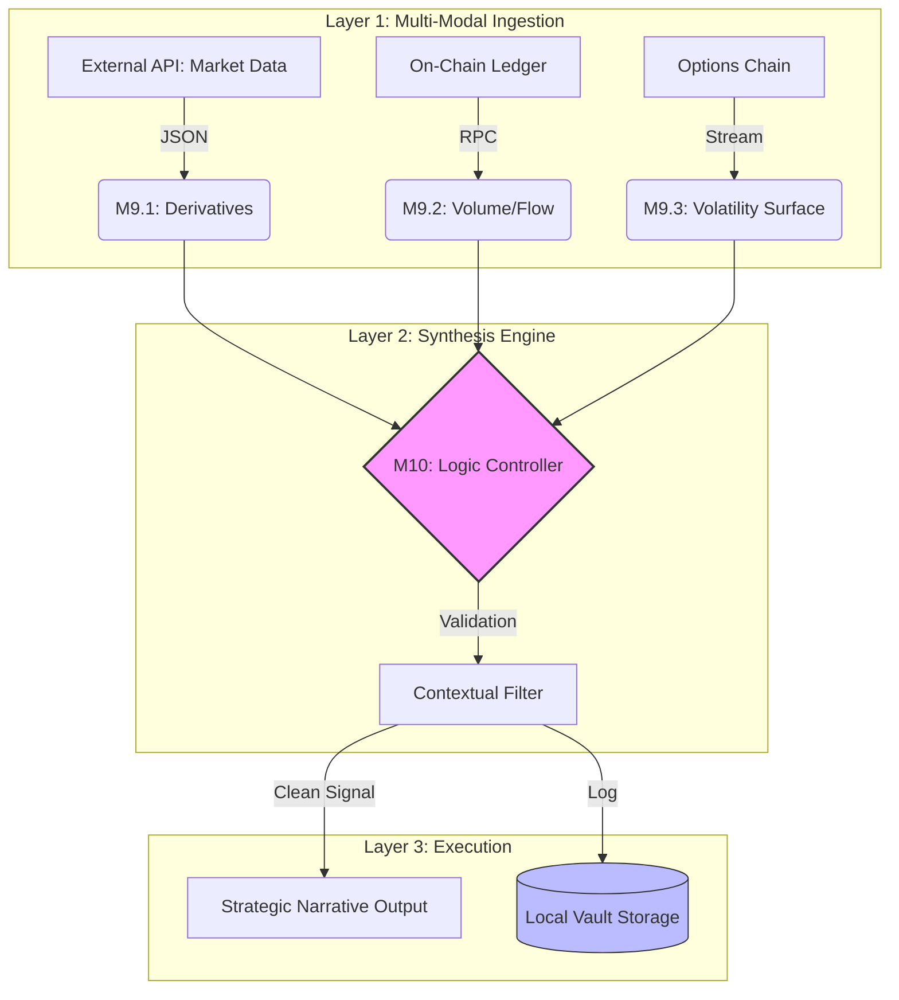

# Apex Expert 2.0: Strategic Intelligence & Narrative Engine

**Architect:** Bijan Arianlou | **Role:** Principal Systems Architect
**Status:** Production Release (v2.0) | **Classification:** Institutional Proprietary

---

## 1. Architectural Intent
Apex Expert 2.0 is a deterministic intelligence layer designed for institutional-grade digital asset analysis. It systematically solves the "crisis of context" by synthesizing multi-modal data into actionable strategy, bridging the gap between raw telemetry and executive decision-making.

## 2. System Hierarchy (M9 - M10)
The engine operates on a hierarchical logic stack, processing data through three distinct perception layers before synthesis.

### Architectural Flow (Live Render)

### Core Modules
*   **M9.1 Perception:** Automated Derivatives Telemetry.
*   **M9.2 Understanding:** On-Chain Conviction Modeling.
*   **M9.3 Foresight:** Volatility Surface & Options Chain Analysis.
*   **M10 Synthesis:** Unified weighting engine for deterministic conviction scoring.

---

## Proprietary Notice
The source logic for Apex Expert 2.0 is maintained in a secure, air-gapped registry (apex-expert-2.0-vault). This repository serves as the canonical technical overview and architectural blueprint.

Access Requirements:
Full source access or implementation consultations are available to aligned institutional partners and qualified technical auditors.
> Contact the Architect for access credentials.

